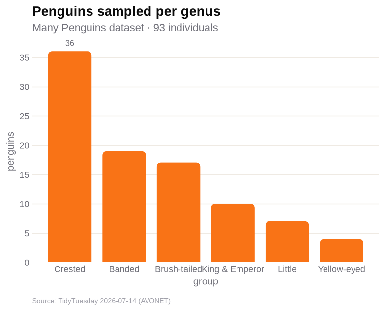
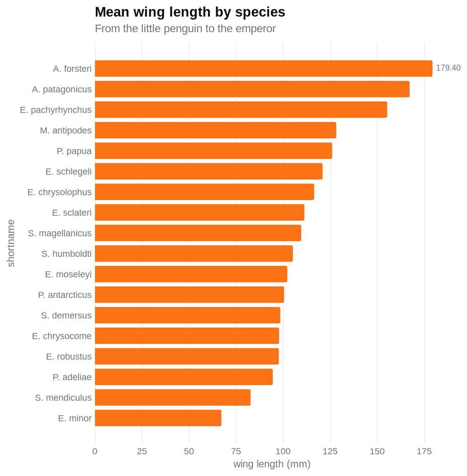
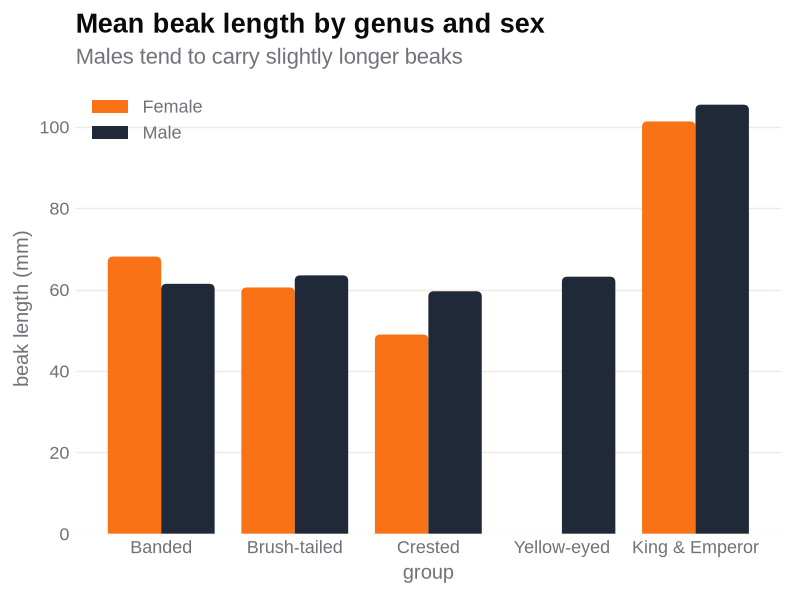
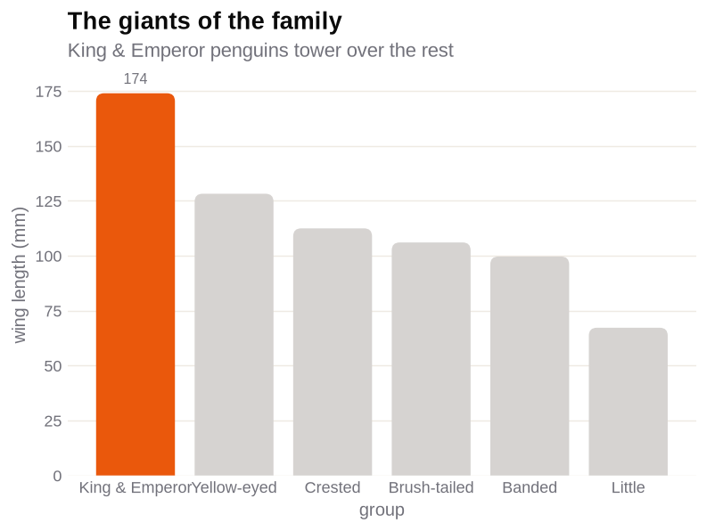
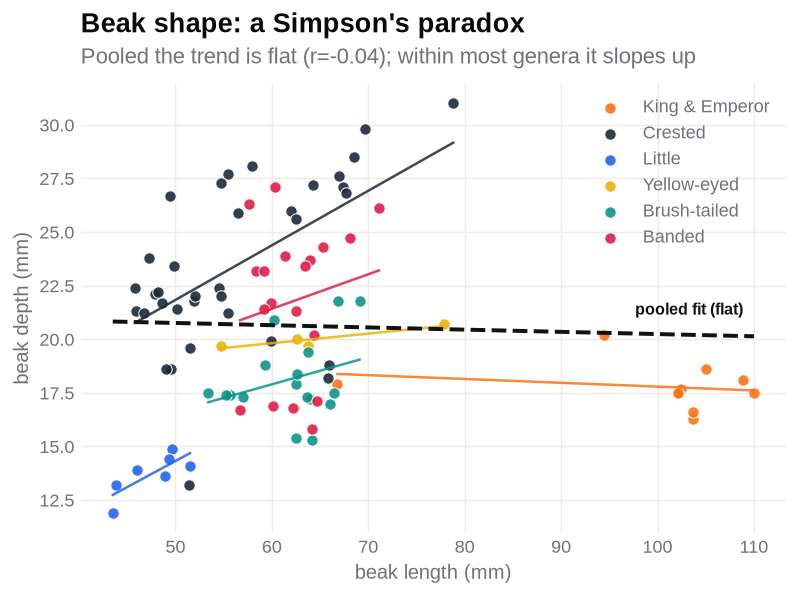
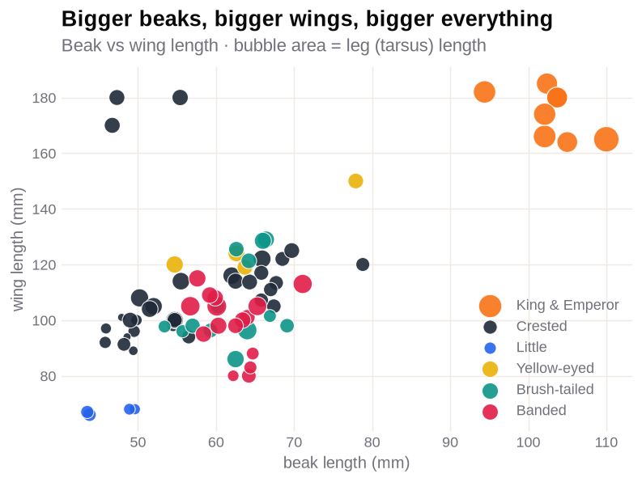
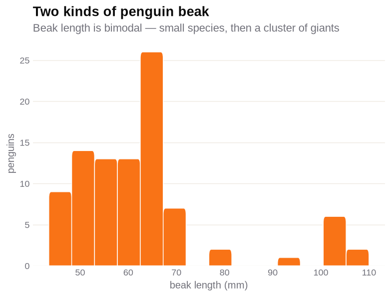
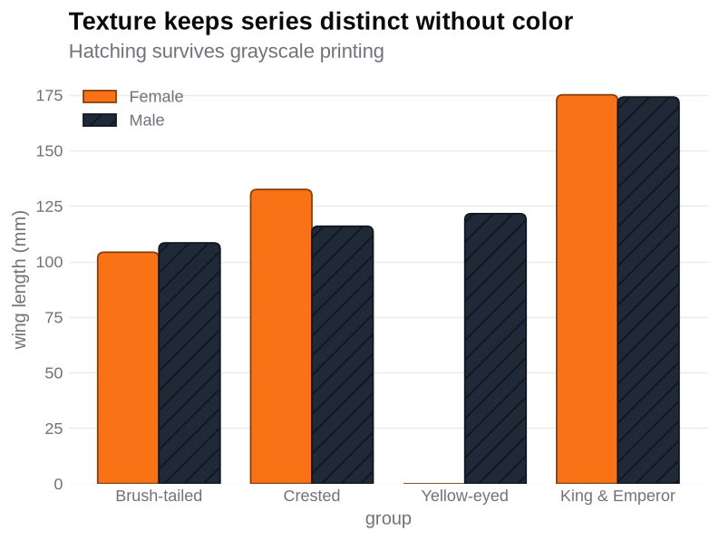

# 🐧 Many Penguins — a `chartcn` mini-project

A small, self-contained demo of [**chartcn**](https://pypi.org/project/chartcn/0.1.0/)
(a shadcn-inspired matplotlib wrapper for pandas DataFrames), built on the
[TidyTuesday *Many Penguins*](https://github.com/rfordatascience/tidytuesday/tree/main/data/2026/2026-07-14)
dataset — morphometric measurements for **93 penguins across 18 species and 6 genera**,
drawn from the [AVONET database](https://opentraits.org/datasets/avonet.html).

> **Scope:** this folder is a **capabilities test only** — it lives on a throwaway
> branch that is never merged to `master`. It uses the published `chartcn` **0.1.0**
> as-is; it does **not** add or change any library code.

The story is told with chartcn's **bar, scatter, and histogram** charts — each matched
to the shape of the question — and styled with a custom *penguin* theme
(white · black · orange · gold).

> **Why no line charts?** An earlier draft used them, but this data has no time axis or
> continuous predictor — genera and species are *categories*. A line implies the slope
> between points is meaningful, so connecting categories invents a trend that isn't
> there. Bars (compare categories), scatters (relate two continuous traits), and
> histograms (show a distribution) fit the data honestly; line does not.

## Contents

```
example-mini-project/
├── README.md                 # you are here
├── penguins.ipynb            # the notebook: load → clean → eight charts (with outputs)
├── data/
│   └── many_penguins.csv     # raw data (downloaded from TidyTuesday 2026-07-14)
└── images/                   # charts rendered by the notebook
```

## Run it

From the repository root:

```bash
pip install chartcn            # the published package this demo showcases
pip install jupyter            # to open the notebook

jupyter notebook example-mini-project/penguins.ipynb
```

The notebook reads `data/many_penguins.csv`, tidies the column names and codes, and
renders every chart into `images/`. It's already executed, so the outputs are visible
on GitHub without running anything.

## The penguin theme

No new built-in theme was added to the package. The palette is just the default
`LIGHT` theme with penguin colors swapped in via the public API:

```python
from dataclasses import replace
import chartcn as viz

penguin = replace(
    viz.LIGHT,
    name="penguin",
    categorical=("#f97316", "#1f2937", "#2563eb", "#eab308",
                 "#0d9488", "#e11d48", "#9333ea", "#78716c"),
    emphasis="#ea580c",
    deemphasis="#d6d3d1",
    gridline="#efeae3",
)
viz.set_theme(penguin)
```

It keeps chartcn's shadcn chrome (rounded bars, no spines, faint grid, both axes
labeled) and just leads with orange + black.

## The charts

| # | Chart | Type | chartcn feature |
|---|---|---|---|
| 1 | Penguins sampled per genus | bar | row **counts** (`y` omitted), `sort=`, auto value label |
| 2 | Mean wing length by species | bar | `horizontal=True` for 18 long labels |
| 3 | Mean beak length by genus & sex | bar | `by=` grouped series + frameless legend |
| 4 | The giants of the family | bar | `highlight=` emphasis (accent one, gray the rest) |
| 5 | Beak shape: a Simpson's paradox | scatter | `by=` color + per-genus trend lines on the returned `Axes` |
| 6 | Bigger beaks, bigger wings | scatter | `size=` third dimension (bubble) + `by=` |
| 7 | Two kinds of penguin beak | hist | a single trait's **distribution** (bimodal) |
| 8 | Texture for black-and-white | bar | `texture=True` hatch channel for accessibility |

### 1 · Penguins sampled per genus


### 2 · Mean wing length by species


### 3 · Mean beak length by genus and sex


### 4 · The giants of the family


### 5 · Beak shape — a Simpson's paradox
Colored by genus, the pooled cloud looks flat (r = −0.04), but the per-genus trend
lines slope **up** inside most genera. The trend lines are plain matplotlib drawn on
the `Axes` chartcn returns.



### 6 · Everything scales together (allometry)
Beak length vs wing length (r ≈ 0.69), with bubble area = leg (tarsus) length — bigger
penguins are bigger everywhere.



### 7 · Two kinds of penguin beak
Beak length is bimodal: a broad cluster of small-to-mid species, a gap, then a cluster
of giants past ~85 mm.



### 8 · Texture channel for black-and-white


## A note on aggregation

`viz.bar` treats `y` as a **magnitude** and *sums* it within each category. For a
per-group **average**, pre-aggregate with pandas (`groupby().mean()`) and pass chartcn
one row per group — every "mean …" bar here does exactly that.

## Data & license

*Many Penguins*, TidyTuesday 2026-07-14, derived from the AVONET database
(Tobias *et al.* 2022). See the
[dataset readme](https://github.com/rfordatascience/tidytuesday/tree/main/data/2026/2026-07-14)
for full provenance and licensing.
