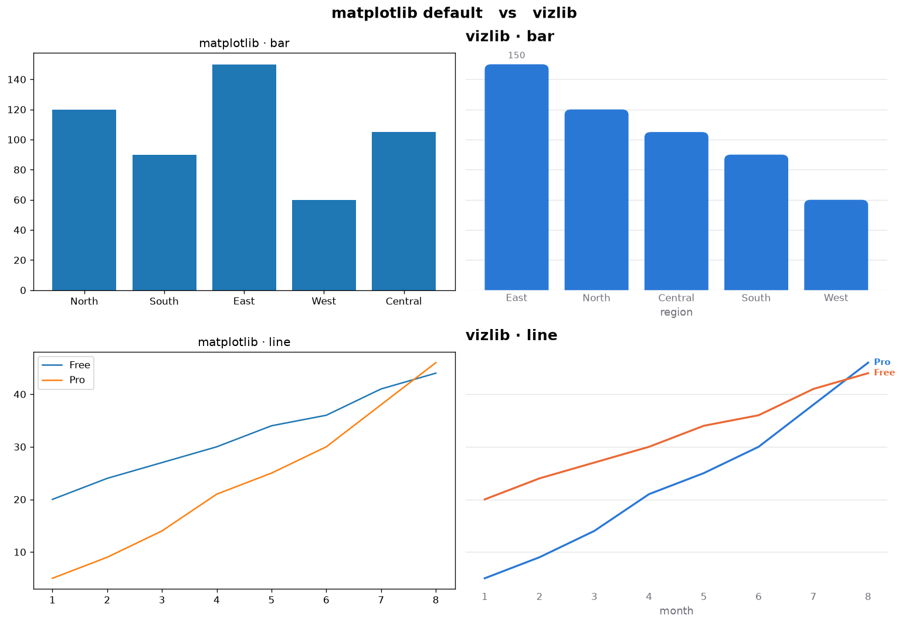
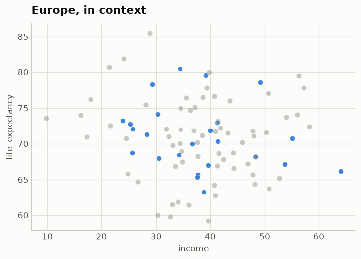
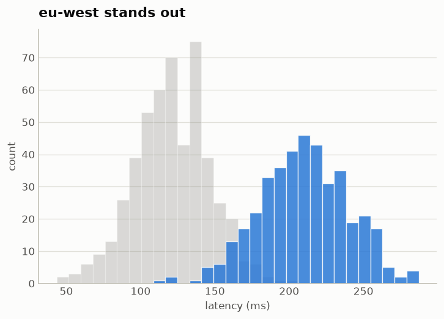
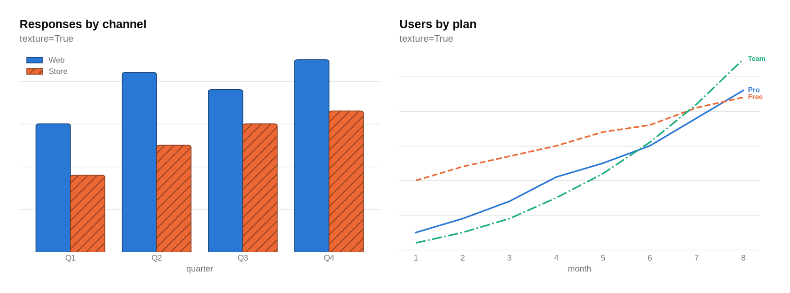
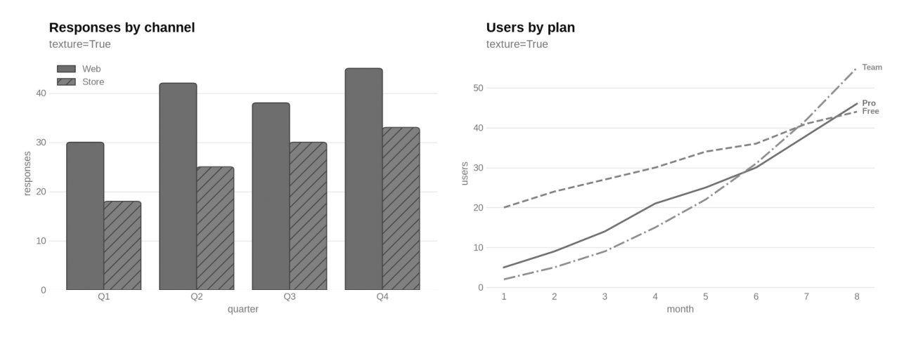
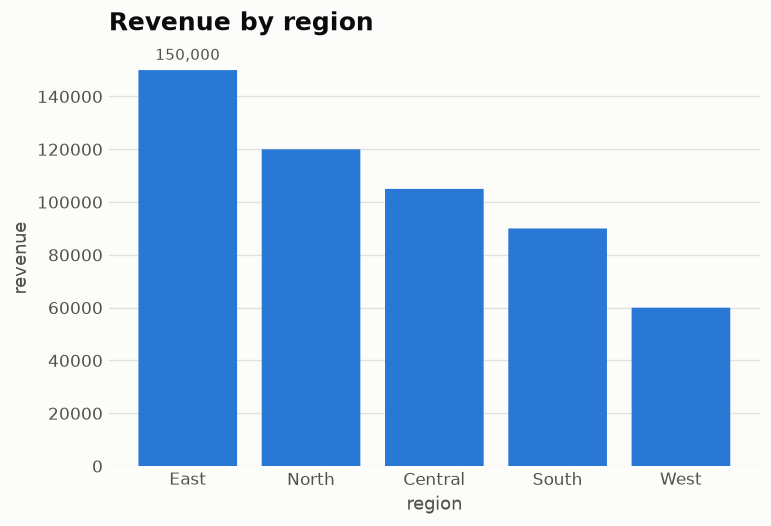
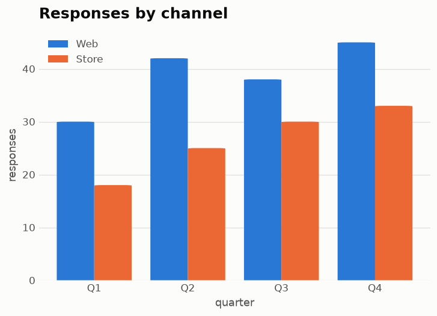
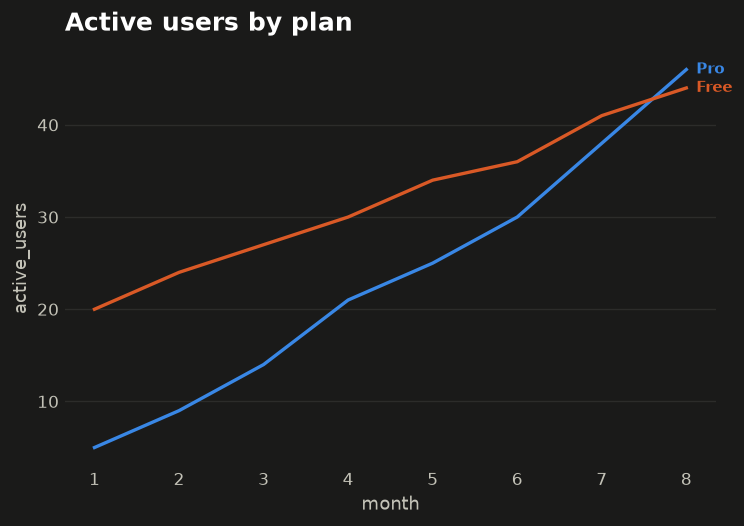

# vizlib examples

Runnable scripts that demonstrate the features implemented so far — the theming
engine and the Core-4 charts (`viz.bar`, `viz.line`, `viz.scatter`, `viz.hist`).
Each script builds a chart from a small pandas DataFrame and saves a PNG into
[`images/`](./images).

## The pitch: matplotlib default vs vizlib

Same data, the same one call — vizlib draws nothing matplotlib can't, it just picks
good defaults ([`before_after.py`](./before_after.py)):



## Setup

From the repository root, install the library (editable) into your environment:

```bash
pip install -e .
```

This pulls in the runtime dependencies (matplotlib, pandas) and puts `vizlib` on
your import path.

## Running the examples

Run any script from the **repository root**:

```bash
python examples/before_after.py
python examples/basic_bar.py
python examples/grouped_and_stacked.py
python examples/emphasis.py
python examples/horizontal_and_counts.py
python examples/line_trends.py
python examples/scatter_relationships.py
python examples/distributions.py
python examples/theming.py
python examples/theme_lime.py
python examples/theme_shadcn.py
python examples/black_and_white.py
```

Or run them all at once:

```bash
for f in examples/*.py; do python "$f"; done
```

Each script prints the path of the image it writes. The scripts save PNGs rather
than opening a window, so they work in a headless environment; to view a chart
interactively instead, replace the `savefig(...)` call with `plt.show()`.

## What each script shows

| Script | Chart | Feature |
|---|---|---|
| [`before_after.py`](./before_after.py) | bar, line | Side-by-side: matplotlib defaults vs vizlib on the same data |
| [`basic_bar.py`](./basic_bar.py) | bar | A single series, sorted, with the top bar auto-labeled |
| [`grouped_and_stacked.py`](./grouped_and_stacked.py) | bar | Multi-series bars via `by=` — grouped and stacked |
| [`emphasis.py`](./emphasis.py) | bar | `highlight=` — accent the one bar that matters, gray the rest |
| [`horizontal_and_counts.py`](./horizontal_and_counts.py) | bar | `horizontal=True`, and row counts when `y` is omitted |
| [`line_trends.py`](./line_trends.py) | line | Multi-series trend and the emphasis form with an endpoint label |
| [`scatter_relationships.py`](./scatter_relationships.py) | scatter | Color by group via `by=`, a third dimension via `size=`, emphasis via `highlight=` |
| [`distributions.py`](./distributions.py) | hist | A single distribution, overlaid groups on shared bins, emphasis via `highlight=` |
| [`theming.py`](./theming.py) | any | The dark theme, the `theme()` context manager, and a custom `Theme` |
| [`theme_lime.py`](./theme_lime.py) | any | The built-in "Lime Green" theme (`lime` / `lime-dark`) |
| [`theme_shadcn.py`](./theme_shadcn.py) | any | The shadcn aesthetic (`shadcn` / `shadcn-dark`) — rounded bars, no spines |
| [`black_and_white.py`](./black_and_white.py) | bar, line | `texture=` secondary encoding, shown in color and desaturated to grayscale |

## Gallery

### `basic_bar.py`
A single series in the slot-1 accent, sorted descending, with only the extreme bar
labeled — the axis carries the rest.


### `grouped_and_stacked.py`
Two series (`Web`, `Store`) in fixed categorical hues, with a frameless legend.
Grouped (left) and stacked (right); stacked segments are separated by a 2px surface
gap.


### `emphasis.py`
`highlight="East"` colors East in the accent hue, pushes every other bar to a muted
gray, drops the legend, and labels the highlighted bar.


### `horizontal_and_counts.py`
Horizontal bars for longer category names (left), and a frequency chart built by
omitting `y` so rows are counted per category (right).


### `line_trends.py`
Two series in fixed hues with a frameless legend (left); the emphasis form (right)
accents `Pro`, grays the rest, drops the legend, and labels just that line's
endpoint.


### `scatter_relationships.py`
Points colored by category with a 2px surface ring, `size=` mapping a numeric column
to marker area, and `highlight=` accenting one group while the rest fade to gray (no
legend).




### `distributions.py`
A single distribution in one hue, two groups overlaid translucently on a shared set
of bins, and `highlight=` bolding one distribution while the rest fade back (no
legend).




### `theming.py`
The built-in dark theme (its own validated steps, not an inversion) and a custom
`Theme` with a warm emphasis accent.


### `black_and_white.py`
`texture=True` adds a non-color channel — hatches on bars, dash patterns on lines —
so series survive grayscale printing and read for colorblind viewers. Below: the
color render, then the same figure desaturated to grayscale, where every series is
still distinct.




### `theme_lime.py`
The built-in **Lime Green** theme (ported from a shadcn theme). The lime primary
leads single-series and first-series charts; the rest of the palette is a curated,
distinct set. Light (`lime`) and dark (`lime-dark`) variants.


### `theme_shadcn.py`
The **shadcn** / **shadcn-dark** theme mimics the shadcn charts look — rounded bar
ends, no axis spines, a faint horizontal-only grid, muted labels — over vizlib's
validated palette (only the chrome/shape changes).




